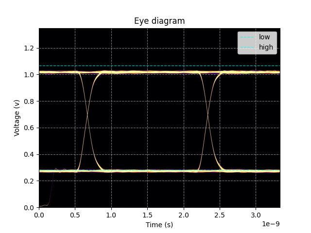
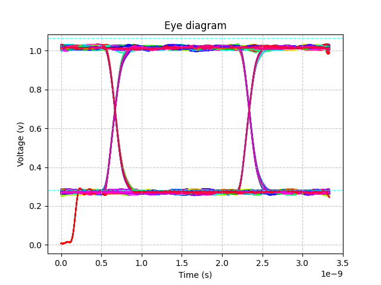
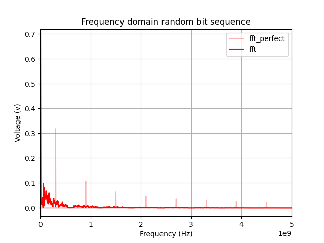

# Personal repository for Simulating PCB with openEMS.
The project in question: [PCB\_For\_FPGA\_Path\_Tracer](https://github.com/Scrarf/PCB_For_FPGA_Path_Tracer).

This repo is just a showcase of the simulation results. It is not supossed to be used by anyone else except me (because for readibility issues) but anyone is welcome to use it as reference or inspiration. I will also provide command line args and usage guide for anyone interested.

## Dependencies:

- [openEMS](https://github.com/thliebig/openEMS) ([Instalation guide](https://docs.openems.de/install.html). You also need to install its python interface)
- [MatPlotLib](https://github.com/matplotlib/matplotlib)
- [scikit-rf](https://github.com/scikit-rf/scikit-rf)
- [ffmpeg](https://github.com/FFmpeg/FFmpeg) (For image sequence assembly. Optional)


## Ussage:
asdwdasd
main file to run is "execute.py" located in scripts/execute.py.
```python
# you must cd into scripts/ directory to run files.
$ cd scripts/

# run execute.py to see possible arguments:
$ python3 execute.py

# This will result in the output:
# No command given, expect "generate", "simulate", "postproc", "debug", "save_touchstone"

# run:
$ python3 execute.py simulate <excited_port_number>
# to simulate a specific port.
# this will create a folder directory "scripts/sim/port_{excited_port_number}"
# and run the simulation for that specific port.
# you can run multiple simulations at the same time on different machines
# and they will not interfere with each other.

# run:
$ python3 execute.py generate
# this generates geometry and previews it using AppCSXCAD. usefull for debugging.

# also you can run:
$ python3 execute.py debug
# this generates "material_dump.vtr", "operator_dump.vtr" and "PEC_dump.vtp"
# for debugging porpuses in the directory: "scripts/sim/"

# you can run:
$ python3 execute.py postproc <action> <output_port, input_port>
# to display the plot of selected S-parameter.
# the <action> can be the following:
# "s_param", "smith_chart", "tdr"
# which then neets to be followed with <output_port, input_port>
# for example:
$ python3 execute.py postproc s_param 3,3 4,3 5,3
# multiple S parameters can be displayed at once

# you can run:
$ python3 execute.py save_touchstone
# to save the touchstone file from the generated port_{n} folders.
# note: each folder is responsibe for each collumn of the matrix,
# if the foldr is missing the values in the coresponding collumn will be filled with NaNs.
```

#### The geometry form KiCAD was exported as .glb file. Blender was used for geometry cleanup and port placement.
several scripts are provided that are only supossed to be opened in blender which provide easy way to export mesh lines and ports.

```python
# to export meshlines run:
$ export_meshlines.py
# this requires for you to have a collection named: "mesh_lines"
# which requires to have nested collections named: "x", "y" and "z".
# in each coresponding axis add planes or any object in aspecific location,
# the script automaticly prints the python array that you can copy paste
# into the execute.py as "mesh_lines_{x, y or z}" array.

# to export ports you can run:
$ export_ports.py
# this exports all ports in the collection named: "Ports" and its nested collections.
# Ports need to be Axis aligned rectangles.
# Ports are automaticly exported into a "ports.py" python file that is automaticly
# imported into execute.py (no need to paste this time).

```
# Gallery





("fft_perfect" is a perfect is a continious 300MHz signal in frequency domain)

The signal integrity is so perfect that I am worried I did something wrong.

<video src="https://raw.githubusercontent.com/Scrarf/EM-PCB-SIM/master/docs/field_mag.mp4" controls="controls" style="max-width: 100%;">
</video>

